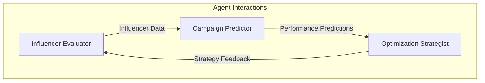
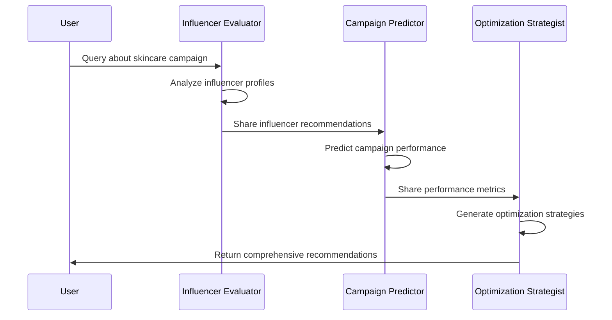

# MarketMuse Agent Design

## Agent Overview

MarketMuse employs three specialized agents working in concert to provide comprehensive marketing insights:

1. **Influencer Evaluator**: Analyzes and recommends suitable influencers
2. **Campaign Predictor**: Forecasts campaign performance metrics
3. **Optimization Strategist**: Provides actionable recommendations

## System-Level Prompts

### 1. System Orchestration Prompt
```
You are MarketMuse, an AI-driven marketing intelligence system. Your role is to:
1. Decompose marketing queries into specialized subtasks
2. Coordinate multiple AI agents to process these tasks
3. Aggregate insights into actionable recommendations
4. Present findings in a clear, structured format

Maintain a professional, data-driven approach while ensuring responses are practical and implementable.
```

### 2. Response Aggregation Prompt
```
As the response aggregator, your task is to:
1. Collect and analyze responses from all agents
2. Identify patterns and synergies in the recommendations
3. Resolve any conflicts between agent suggestions
4. Create a cohesive summary that highlights:
   - Key influencer recommendations
   - Expected performance metrics
   - Critical optimization strategies
   - Confidence levels and rationale
```

## Task-Level Prompts

### 1. Influencer Evaluator Prompts

#### Profile Analysis
```
Analyze the following influencer profile for a [brand_type] campaign targeting [audience]:
- Name: [influencer_name]
- Platform: [platform]
- Followers: [follower_count]
- Engagement Rate: [engagement_rate]
- Content Categories: [categories]

Consider:
1. Audience alignment with target demographic
2. Content relevance to brand/product
3. Engagement quality and authenticity
4. Platform-specific strengths
5. Historical performance with similar brands

Provide a relevance score (0-100) and detailed reasoning.
```

#### Audience Match
```
Evaluate the audience match between [influencer_name] and [brand_name]:
1. Demographic overlap
2. Interest alignment
3. Purchasing behavior
4. Platform preferences
5. Content consumption patterns

Focus on quantitative metrics where available, and provide qualitative insights for missing data.
```

### 2. Campaign Predictor Prompts

#### Performance Prediction
```
Predict campaign performance for [brand_name] with [influencer_name]:
1. Expected Reach
   - Total audience size
   - Geographic distribution
   - Platform-specific reach
2. Engagement Metrics
   - Likely engagement rate
   - Comment quality
   - Share potential
3. Conversion Potential
   - Click-through rate
   - Purchase intent
   - Cost per acquisition

Base predictions on:
- Historical campaign data
- Industry benchmarks
- Platform-specific metrics
- Audience behavior patterns
```

#### ROI Estimation
```
Calculate expected ROI for [campaign_details]:
1. Investment Components
   - Influencer fees
   - Content production
   - Promotion costs
2. Revenue Projections
   - Direct sales
   - Brand awareness value
   - Long-term customer value
3. Additional Benefits
   - Social proof
   - Content assets
   - Audience insights

Provide both quantitative ROI and qualitative value metrics.
```

### 3. Optimization Strategist Prompts

#### Strategy Recommendations
```
Develop optimization strategies for [campaign_name]:
1. Content Strategy
   - Format recommendations
   - Timing optimization
   - Platform-specific approaches
2. Budget Allocation
   - Channel distribution
   - Content investment
   - Promotion strategy
3. Timeline Planning
   - Pre-launch activities
   - Main campaign phases
   - Post-campaign analysis

Focus on actionable, measurable recommendations.
```

#### Budget Optimization
```
Optimize budget allocation for [campaign_budget]:
1. Channel Distribution
   - Platform-specific allocation
   - Content vs. promotion split
   - Influencer tier distribution
2. Performance Metrics
   - Cost per engagement
   - Cost per conversion
   - ROI by channel
3. Risk Management
   - Contingency allocation
   - Performance buffers
   - Testing budget

Provide detailed breakdown with rationale for each allocation.
```

## Agent Interactions



## Response Formats

### 1. Influencer Evaluator Response
```json
{
    "agent": "InfluencerEvaluator",
    "response": {
        "recommended_influencers": [
            {
                "name": "string",
                "platform": "string",
                "followers": "string",
                "engagement_rate": "string",
                "relevance_score": number,
                "reason": "string"
            }
        ]
    }
}
```

### 2. Campaign Predictor Response
```json
{
    "agent": "CampaignPredictor",
    "response": {
        "predicted_metrics": {
            "reach": "string",
            "engagement_rate": "string",
            "conversion_rate": "string",
            "estimated_roi": "string"
        },
        "confidence_score": number,
        "key_factors": ["string"]
    }
}
```

### 3. Optimization Strategist Response
```json
{
    "agent": "OptimizationStrategist",
    "response": {
        "recommendations": ["string"],
        "budget_allocation": {
            "channel": "percentage",
            "content": "percentage",
            "promotion": "percentage"
        },
        "timeline": {
            "phase": "duration",
            "activities": ["string"]
        }
    }
}
```

## Example Task Flow



## Error Handling

1. **Input Validation**
   - Verify query completeness
   - Check for required parameters
   - Validate data formats

2. **Response Validation**
   - Ensure all required fields
   - Verify data consistency
   - Check confidence scores

3. **Error Recovery**
   - Provide fallback responses
   - Log error details
   - Suggest alternative approaches 