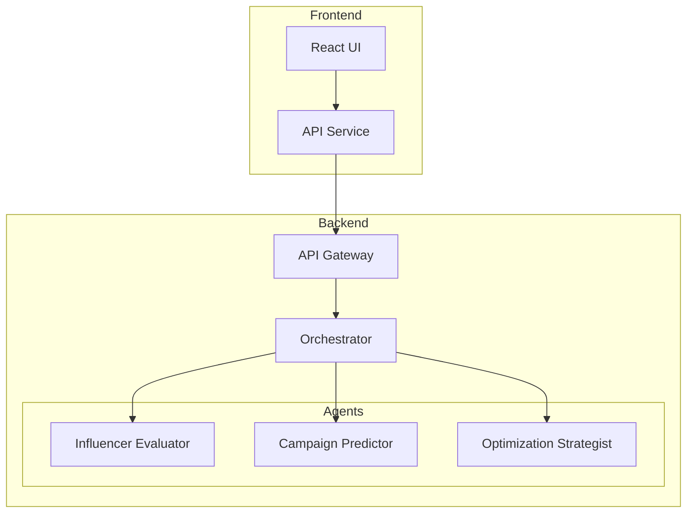
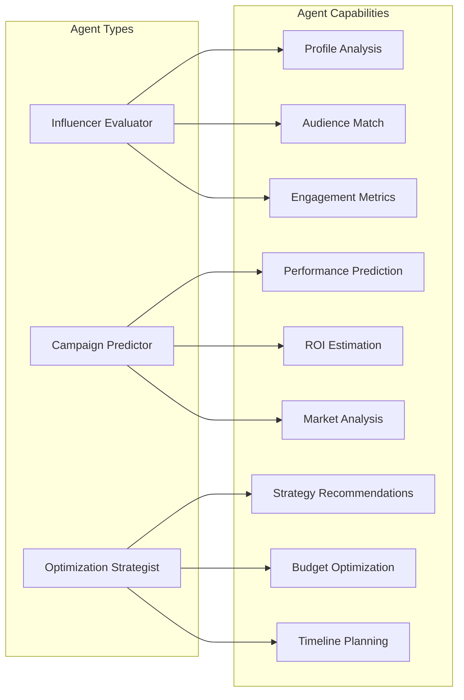
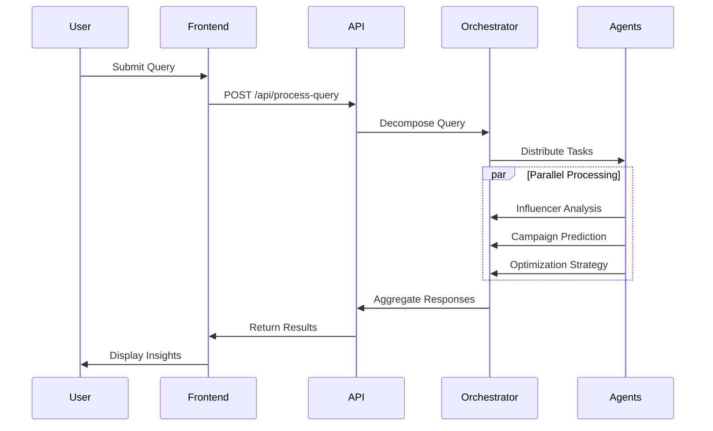
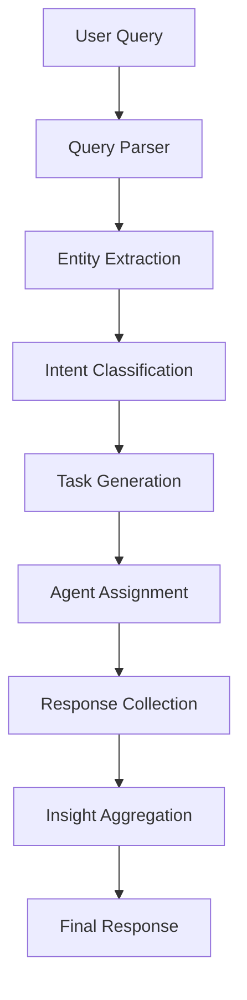
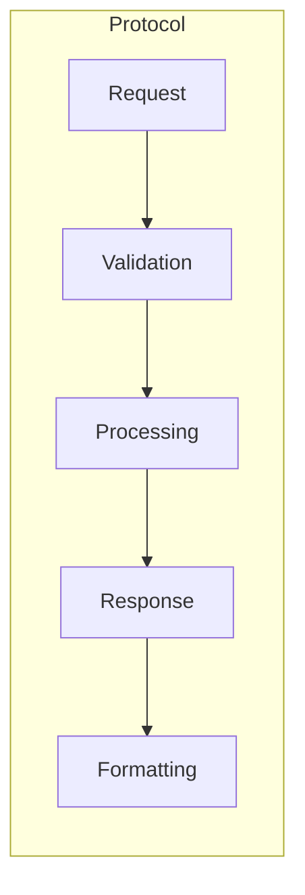

# MarketMuse System Architecture

## High-Level Architecture



## Component Details

### 1. Frontend Layer
- **React UI**: Modern, responsive interface for user interactions
- **API Service**: Handles communication with backend services
- **State Management**: Manages application state and agent responses
- **Component Structure**:
  - QueryInput: Handles user query submission
  - AgentResponses: Displays agent responses and insights
  - SummaryView: Shows consolidated recommendations

### 2. Backend Layer

#### API Gateway
- FastAPI-based REST API
- Handles request validation and routing
- Manages CORS and security
- Endpoints:
  - `/api/process-query`: Main query processing endpoint
  - `/api/health`: Health check endpoint

#### Orchestrator
- Central coordination component
- Responsibilities:
  - Query decomposition
  - Task distribution
  - Response aggregation
  - Error handling
  - State management

#### Agent System


## Data Flow



## System Components

### 1. Query Processing Pipeline


### 2. Agent Communication Protocol


## Data Structures

### 1. Query Request
```typescript
interface QueryRequest {
    query: string;
}
```

### 2. Agent Response
```typescript
interface AgentResponse {
    agent: string;
    query: string;
    response: {
        recommended_influencers?: Array<{
            name: string;
            platform: string;
            followers: string;
            engagement_rate: string;
            relevance_score: number;
            reason: string;
        }>;
        predicted_metrics?: {
            reach: string;
            engagement_rate: string;
            conversion_rate: string;
            estimated_roi: string;
        };
        recommendations?: string[];
        confidence_score?: number;
    };
}
```

### 3. System Response
```typescript
interface QueryResponse {
    query: string;
    agent_responses: {
        [key: string]: AgentResponse;
    };
    summary: {
        top_influencers: string[];
        expected_performance: {
            reach: string;
            engagement: string;
            roi: string;
        };
        key_recommendations: string[];
        confidence_score: number;
    };
}
```

## Security Considerations

1. **API Security**
   - CORS configuration
   - Request validation
   - Rate limiting
   - Error handling

2. **Data Protection**
   - Input sanitization
   - Response validation
   - Secure communication

3. **Error Handling**
   - Graceful degradation
   - Error reporting
   - Recovery mechanisms

## Scalability Considerations

1. **Horizontal Scaling**
   - Stateless design
   - Load balancing
   - Caching strategies

2. **Performance Optimization**
   - Parallel processing
   - Response caching
   - Resource management

3. **Monitoring**
   - Health checks
   - Performance metrics
   - Error tracking 