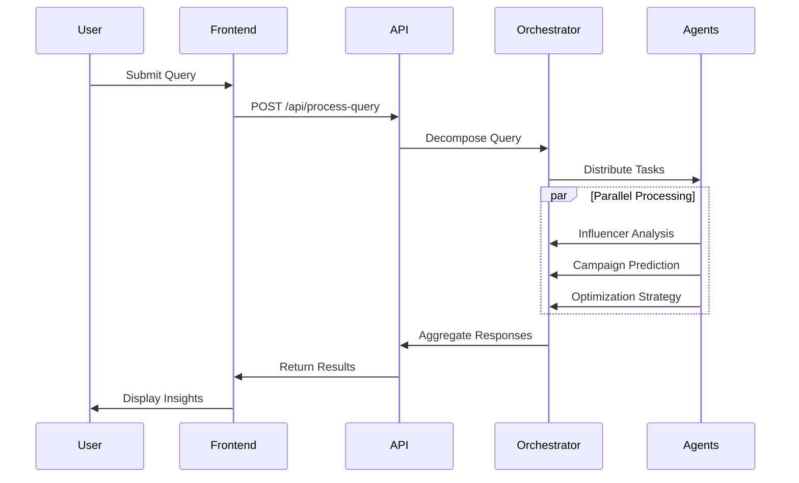
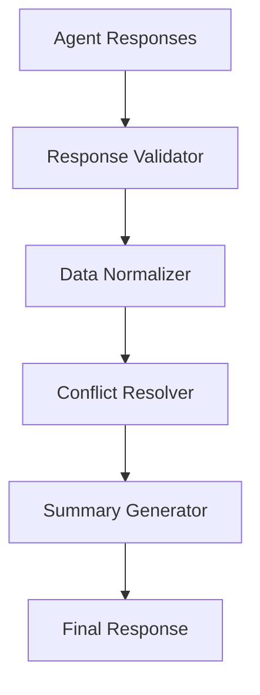

# MarketMuse Technical Implementation

## Backend Implementation

### 1. Core Components

#### API Gateway (FastAPI)
```python
from fastapi import FastAPI, HTTPException
from fastapi.middleware.cors import CORSMiddleware

app = FastAPI(title="MarketMuse API")

# CORS configuration
app.add_middleware(
    CORSMiddleware,
    allow_origins=["*"],
    allow_credentials=True,
    allow_methods=["*"],
    allow_headers=["*"],
)

# Main endpoint
@app.post("/api/process-query")
async def process_query(request: QueryRequest):
    try:
        result = await orchestrator.process_query(request.query)
        return result
    except Exception as e:
        raise HTTPException(status_code=500, detail=str(e))
```

#### Orchestrator
```python
class Orchestrator:
    def __init__(self):
        self.agents = {
            "influencer_evaluator": InfluencerEvaluator(),
            "campaign_predictor": CampaignPredictor(),
            "optimization_strategist": OptimizationStrategist()
        }

    async def process_query(self, query: str) -> Dict[str, Any]:
        # Decompose query
        subtasks = self._decompose_query(query)
        
        # Process tasks in parallel
        responses = await asyncio.gather(*[
            self.agents[task["agent"]].process_task(task)
            for task in subtasks
        ])
        
        # Generate summary
        summary = self._generate_summary(responses)
        
        return {
            "query": query,
            "agent_responses": responses,
            "summary": summary
        }
```

### 2. Agent Implementation

#### Base Agent Class
```python
class Agent:
    def __init__(self, name: str):
        self.name = name
        
    async def process_task(self, task: Dict[str, Any]) -> Dict[str, Any]:
        """Process a task and return response"""
        raise NotImplementedError
```

#### Influencer Evaluator
```python
class InfluencerEvaluator(Agent):
    async def process_task(self, task: Dict[str, Any]) -> Dict[str, Any]:
        # Extract brand and audience info
        brand_info = task.get("brand_info", {})
        audience = task.get("audience", {})
        
        # Generate recommendations
        recommendations = await self._evaluate_influencers(brand_info, audience)
        
        return {
            "agent": self.name,
            "response": {
                "recommended_influencers": recommendations
            }
        }
```

#### Campaign Predictor
```python
class CampaignPredictor(Agent):
    async def process_task(self, task: Dict[str, Any]) -> Dict[str, Any]:
        # Extract campaign parameters
        params = task.get("parameters", {})
        
        # Generate predictions
        predictions = await self._predict_performance(params)
        
        return {
            "agent": self.name,
            "response": {
                "predicted_metrics": predictions,
                "confidence_score": self._calculate_confidence(predictions)
            }
        }
```

#### Optimization Strategist
```python
class OptimizationStrategist(Agent):
    async def process_task(self, task: Dict[str, Any]) -> Dict[str, Any]:
        # Extract current performance and goals
        performance = task.get("performance", {})
        goals = task.get("goals", {})
        
        # Generate recommendations
        recommendations = await this._generate_recommendations(performance, goals)
        
        return {
            "agent": this.name,
            "response": {
                "recommendations": recommendations
            }
        }
```

## Frontend Implementation

### 1. Component Structure

#### App Component
```typescript
import React from 'react';
import { ThemeProvider, createTheme, CssBaseline, Container } from '@mui/material';
import QueryInput from './components/QueryInput';

const theme = createTheme({
  palette: {
    mode: 'light',
    primary: {
      main: '#1976d2',
    },
    secondary: {
      main: '#dc004e',
    },
  },
});

function App() {
  return (
    <ThemeProvider theme={theme}>
      <CssBaseline />
      <Container maxWidth="lg">
        <QueryInput />
      </Container>
    </ThemeProvider>
  );
}
```

#### QueryInput Component
```typescript
import React, { useState } from 'react';
import { Box, TextField, Button, Typography, Paper, CircularProgress } from '@mui/material';
import { processQuery } from '../services/api';
import AgentResponses from './AgentResponses';

const QueryInput: React.FC = () => {
    const [query, setQuery] = useState<string>('');
    const [loading, setLoading] = useState<boolean>(false);
    const [error, setError] = useState<string | null>(null);
    const [result, setResult] = useState<QueryResponse | null>(null);

    const handleSubmit = async (e: React.FormEvent) => {
        e.preventDefault();
        if (!query.trim()) return;

        setLoading(true);
        setError(null);
        try {
            const response = await processQuery(query);
            setResult(response);
        } catch (err) {
            setError(err instanceof Error ? err.message : 'An error occurred');
        } finally {
            setLoading(false);
        }
    };

    return (
        <Box sx={{ maxWidth: 1200, mx: 'auto', p: 3 }}>
            <Paper elevation={3} sx={{ p: 4, mb: 4 }}>
                <Typography variant="h4" gutterBottom>
                    MarketMuse - AI-Driven Marketing Intelligence
                </Typography>
                <form onSubmit={handleSubmit}>
                    <TextField
                        fullWidth
                        multiline
                        rows={3}
                        label="Marketing Query"
                        value={query}
                        onChange={(e) => setQuery(e.target.value)}
                        placeholder="Example: Identify the optimal influencers and predict campaign outcomes for launching a new sustainable skincare brand targeting Gen Z audiences"
                        variant="outlined"
                        margin="normal"
                        required
                    />
                    <Box sx={{ mt: 2, display: 'flex', justifyContent: 'center' }}>
                        <Button
                            type="submit"
                            variant="contained"
                            color="primary"
                            disabled={loading || !query.trim()}
                            sx={{ minWidth: 200 }}
                        >
                            {loading ? <CircularProgress size={24} /> : 'Process Query'}
                        </Button>
                    </Box>
                </form>
            </Paper>
            {result && <AgentResponses agentResponses={result.agent_responses} />}
        </Box>
    );
};
```

### 2. API Service

```typescript
import axios from 'axios';
import { QueryResponse } from '../types';

const API_BASE_URL = 'http://localhost:8000/api';

const api = axios.create({
    baseURL: API_BASE_URL,
    headers: {
        'Content-Type': 'application/json',
    },
});

export const processQuery = async (query: string): Promise<QueryResponse> => {
    try {
        const response = await api.post<QueryResponse>('/process-query', { query });
        return response.data;
    } catch (error) {
        if (axios.isAxiosError(error)) {
            throw new Error(error.response?.data?.detail || 'An error occurred while processing the query');
        }
        throw error;
    }
};
```

### 3. Type Definitions

```typescript
export interface AgentResponse {
    agent: string;
    query: string;
    response: {
        recommended_influencers?: Array<{
            name: string;
            platform: string;
            followers: string;
            engagement_rate: string;
            relevance_score: number;
            reason: string;
        }>;
        predicted_metrics?: {
            reach: string;
            engagement_rate: string;
            conversion_rate: string;
            estimated_roi: string;
        };
        recommendations?: string[];
        confidence_score?: number;
    };
}

export interface QueryResponse {
    query: string;
    agent_responses: {
        [key: string]: AgentResponse;
    };
    summary: {
        top_influencers: string[];
        expected_performance: {
            reach: string;
            engagement: string;
            roi: string;
        };
        key_recommendations: string[];
        confidence_score: number;
    };
}
```

## Data Flow

### 1. Request Flow


### 2. Response Flow


## Error Handling

### 1. Backend Error Handling
```python
try:
    result = await process_query(query)
    return result
except ValidationError as e:
    raise HTTPException(status_code=400, detail=str(e))
except ProcessingError as e:
    raise HTTPException(status_code=500, detail=str(e))
except Exception as e:
    raise HTTPException(status_code=500, detail="Internal server error")
```

### 2. Frontend Error Handling
```typescript
try {
    const response = await processQuery(query);
    setResult(response);
} catch (error) {
    if (axios.isAxiosError(error)) {
        setError(error.response?.data?.detail || 'An error occurred');
    } else {
        setError('An unexpected error occurred');
    }
} finally {
    setLoading(false);
}
```

## Performance Optimization

### 1. Backend Optimization
- Parallel processing of agent tasks
- Response caching
- Connection pooling
- Rate limiting

### 2. Frontend Optimization
- Debounced input handling
- Response caching
- Progressive loading
- Error boundary implementation 