# Query Processing in MarketMuse

## Query Processing Overview

MarketMuse processes marketing queries through a sophisticated pipeline that breaks down complex questions into specialized subtasks, routes them to appropriate agents, and aggregates the responses into actionable insights.

## Query Decomposition

### 1. Query Analysis
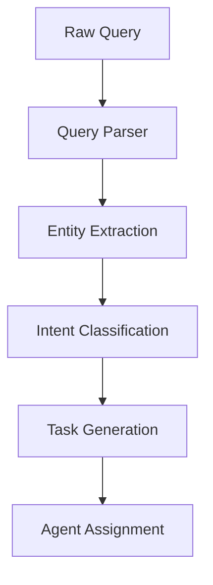

### 2. Entity Extraction
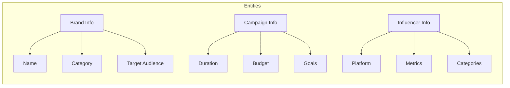

## Routing Logic

### 1. Task Distribution
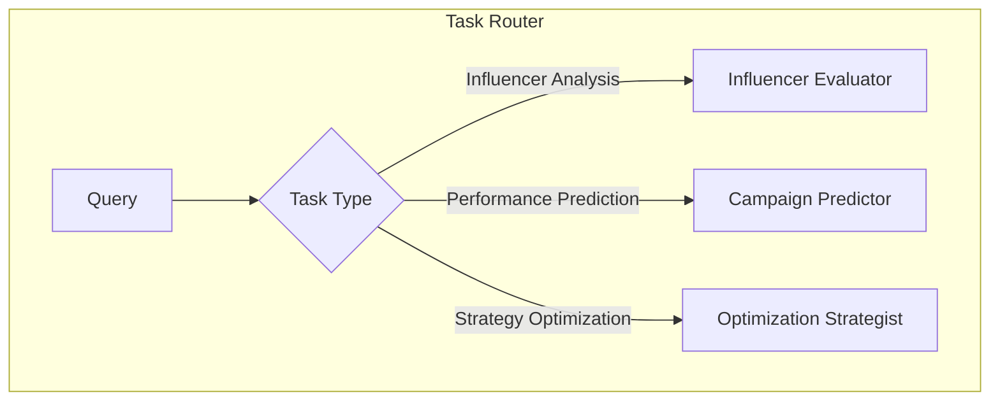

### 2. Agent Selection
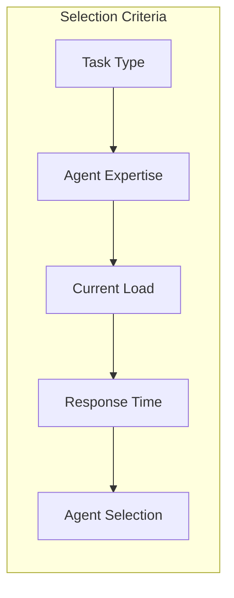

## Response Aggregation

### 1. Data Collection
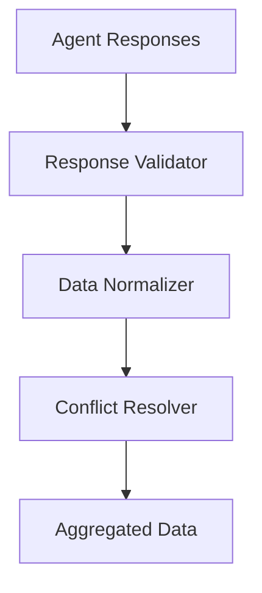

### 2. Insight Generation
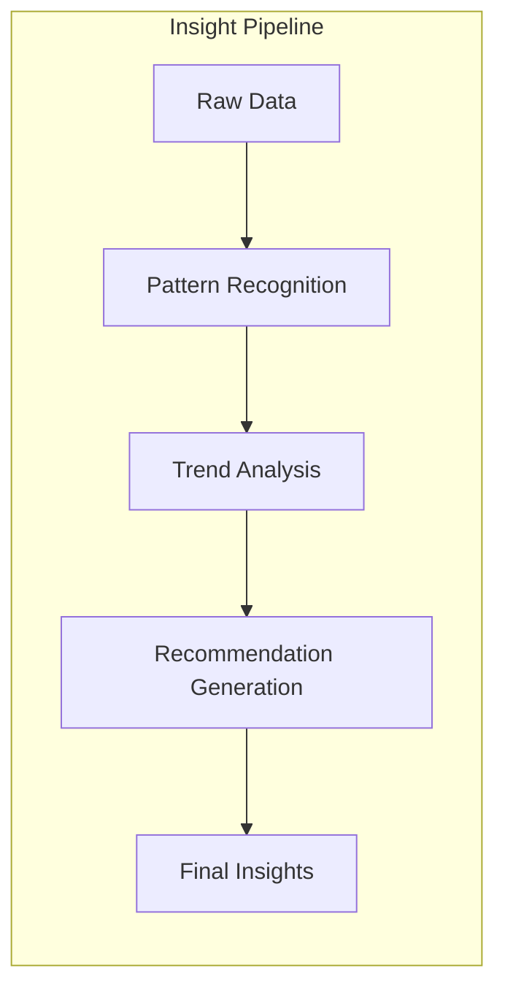

## Example Query Flow

### 1. Sample Query
"Identify the optimal influencers and predict campaign outcomes for launching a new sustainable skincare brand targeting Gen Z audiences"

### 2. Decomposition Process
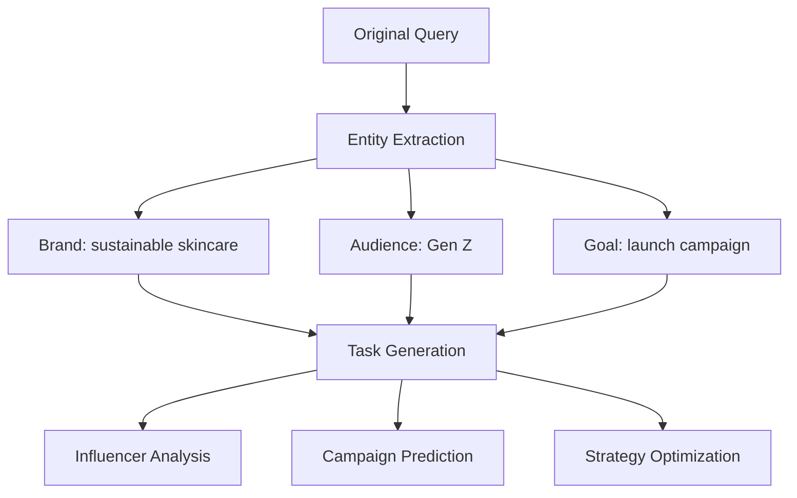

### 3. Task Assignment
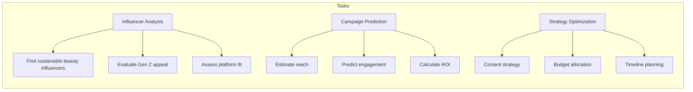

## Response Processing

### 1. Data Validation
```typescript
interface ValidationRules {
    influencerResponse: {
        required: ['name', 'platform', 'followers', 'engagement_rate'],
        optional: ['relevance_score', 'reason']
    },
    campaignResponse: {
        required: ['reach', 'engagement_rate', 'conversion_rate'],
        optional: ['estimated_roi', 'confidence_score']
    },
    strategyResponse: {
        required: ['recommendations'],
        optional: ['budget_allocation', 'timeline']
    }
}
```

### 2. Conflict Resolution
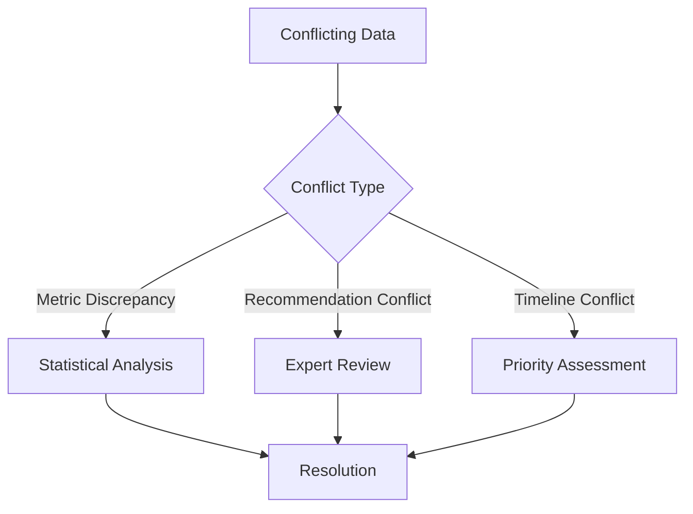

## Implementation Details

### 1. Query Processing Pipeline
```python
def process_query(query: str) -> Dict[str, Any]:
    # 1. Extract entities
    entities = extract_entities(query)
    
    # 2. Generate tasks
    tasks = generate_tasks(entities)
    
    # 3. Assign to agents
    agent_tasks = assign_tasks(tasks)
    
    # 4. Process responses
    responses = process_responses(agent_tasks)
    
    # 5. Generate summary
    summary = generate_summary(responses)
    
    return {
        "query": query,
        "agent_responses": responses,
        "summary": summary
    }
```

### 2. Response Aggregation
```python
def aggregate_responses(responses: List[Dict[str, Any]]) -> Dict[str, Any]:
    # 1. Validate responses
    validated = validate_responses(responses)
    
    # 2. Normalize data
    normalized = normalize_data(validated)
    
    # 3. Resolve conflicts
    resolved = resolve_conflicts(normalized)
    
    # 4. Generate insights
    insights = generate_insights(resolved)
    
    return insights
```

## Error Handling

### 1. Query Processing Errors
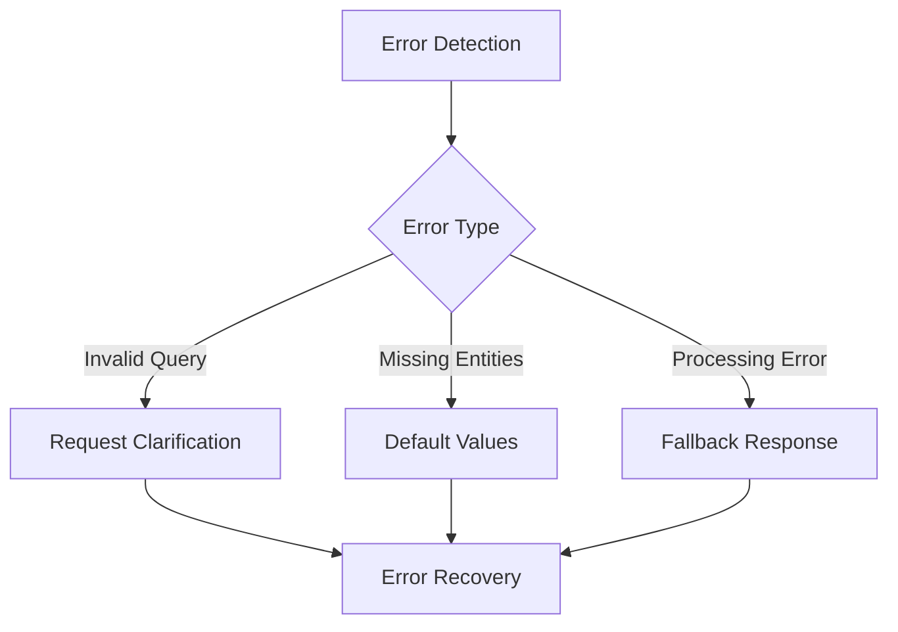

### 2. Response Handling
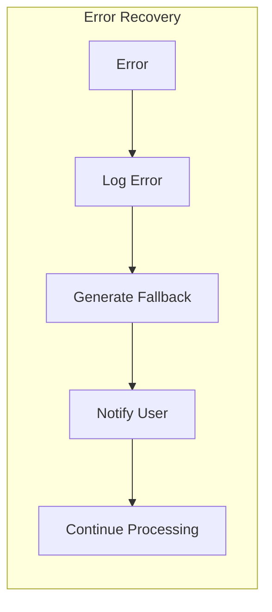

## Performance Optimization

### 1. Parallel Processing
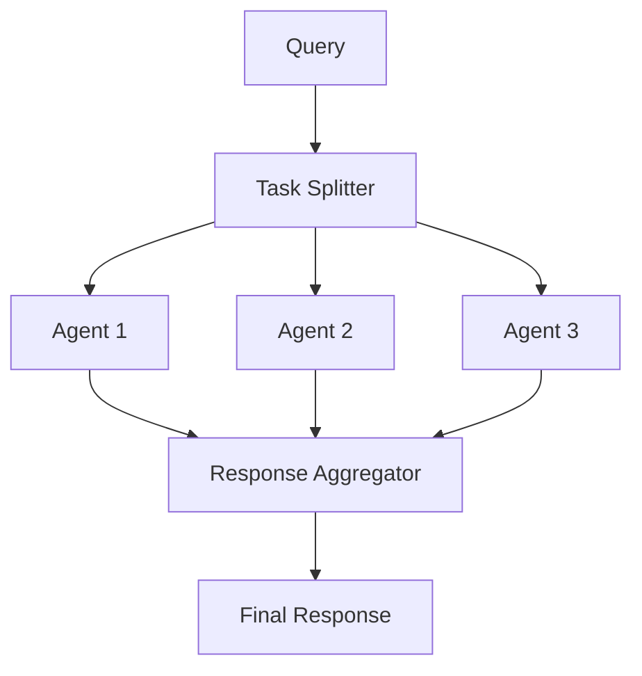

### 2. Caching Strategy
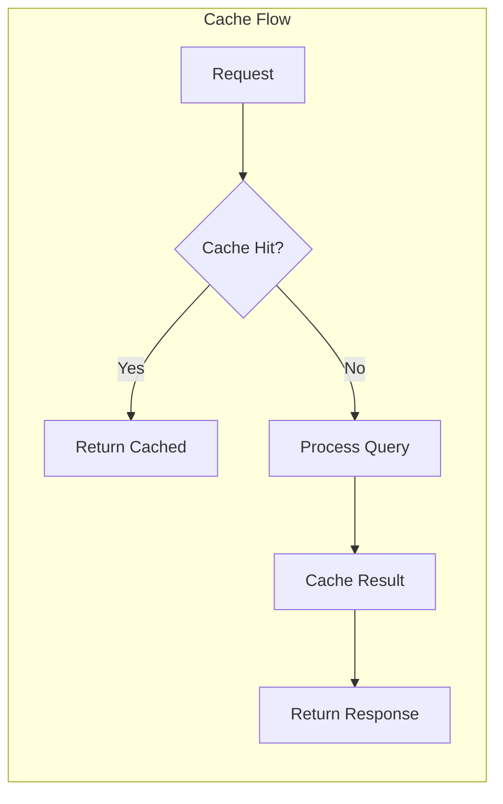